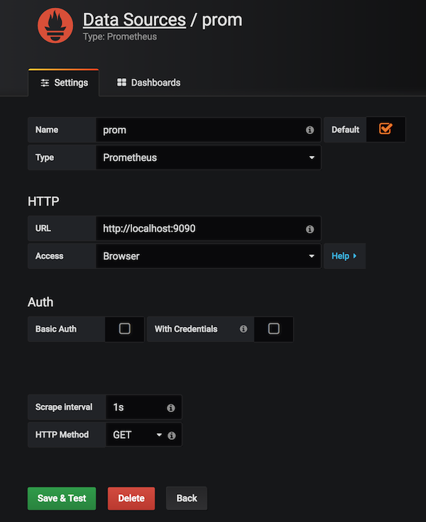

# Telegraf Prometheus Grafana Stack

Real-time monitoring with TPG stack. Telegraf is configured to listen for statsd input (8125/udp). Grafana dashboard will update every second.

## How to use it?
```bash
$ ./main.sh up
```
Open grafana on localhost:3000 and configure prometheus data source with a **1s scrape interval**. This will work fine as long as the number of stats is not too large.



Import the sample dashboard or create your own and set prometheus as the data source.

## Test client

```bash
$ cd testclient
$ npm install
$ node index.js
```